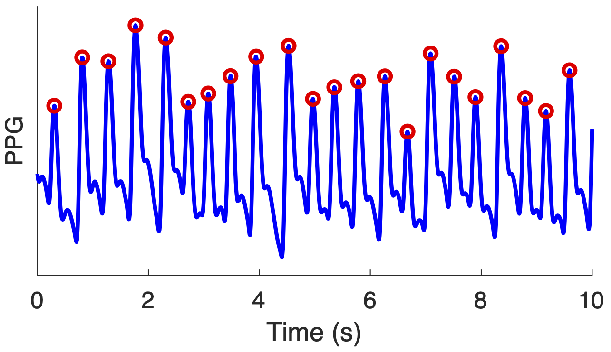

# PPG-beats

**PPG-beats** is a Matlab library of algorithms to detect heartbeats in photoplethysmogram (PPG) signals.

## Background

Photoplethysmography (PPG) sensors are the optical sensors which are now widely used for oxygen saturation and heart rate monitoring in clinical devices (such as pulse oximeters) and consumer devices (such as smartwatches). A wealth of information can be obtained from PPG signals, including heart rate, heart rhythm, and blood oxygen saturation. A fundamental step when deriving such parameters is the detection of individual heartbeats. Indeed, several algorithms have been developed to detect heartbeats in PPG signals.

## Purpose

This software is designed to provide open-source algorithms for detecting heartbeats in PPG signals, and to provide a framework with which to assess their performance. The software is intended for use in research, and is therefore aimed at academic researchers.

## Features

The key features of the library are:

1. **[PPG Beat Detection Algorithms](./toolbox/ppg_beat_detectors)**: A selection of open-source algorithms for detecting beats in PPG signals.
2. **[Performance Assessment Resources](./toolbox/performance_assessment)**: Resources to assess the performance of PPG beat detectors, including:
    - **[Datasets](./datasets/summary)**: several publicly available datasets containing PPG and reference electrocardiogram (ECG) signals.
    - **[Code](./toolbox/performance_assessment)**: MATLAB code with which to assess performance.
3. **[Tutorials](./tutorials/summary)** on how to use the algorithms, datasets, and code.

## Getting started

Details of how to get started with the toolbox are available [here](./toolbox/getting_started/).

## Further Information

Further details of the project, including publications produced using this toolbox, are available at the [project website](https://peterhcharlton.github.io/project/ppg-beats/).

## Citation
When using this toolbox, please cite:

Charlton PH _et al._, [Detecting beats in the photoplethysmogram: benchmarking open-source algorithms](https://doi.org/10.1088/1361-6579/ac826d), Physiological Measurement, 2022.

