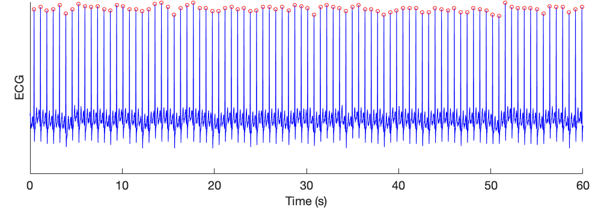
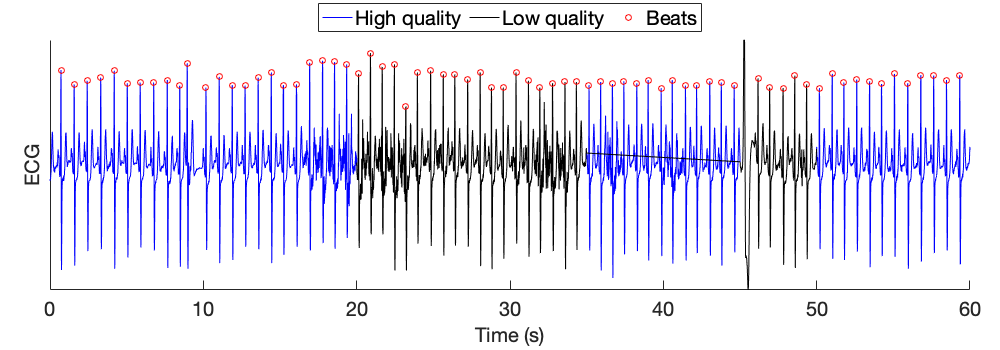

# ECG Beat Detection

This page provides examples of how to use the toolbox for ECG beat detection.

## Detecting beats in an ECG signal

This tutorial demonstrates how to detect beats in an ECG signal using algorithms in the toolbox.

- Download a minute of adult data from [here](https://zenodo.org/record/6967256/files/MIMIC_PERform_1_min_normal.mat?download=1).
- Load this data file into Matlab. The data in this file is contained within a structure named _data_, which contains ECG and other signals. The ECG data can be found at _data.ekg_ (with the ECG signal given in two fields: _v_ contains the ECG samples, and _fs_ is the sampling frequency in Hz).
- Use the following Matlab commands to detect beats in the ECG, and then plot the ECG signal and detected beats:

```matlab
S = data.ekg;    % extract the ECG data
options.win_durn = 20;     % assess agreement between beat detectors using 20-second windows
options.beat_detectors = {'rpeakdetect'};    % specify the ECG beat detector to be used
[beat_inds, qual] = detect_ecg_beats(S.v, S.fs, options);     % detect beats and assess quality of beat detections

figure('Position', [20,20,1000,350])     % Setup figure
subplot('Position', [0.05,0.17,0.92,0.82])
t = [0:length(S.v)-1]/S.fs;             % Make time vector
plot(t, S.v, 'b'), hold on,             % Plot ECG signal
plot(t(find(~qual)), S.v(~qual), 'k')         % Plot low quality segments
plot(t(beat_inds), S.v(beat_inds), 'or'),       % Plot detected beats
ftsize = 20;                            % Tidy up plot
set(gca, 'FontSize', ftsize, 'YTick', [], 'Box', 'off');
ylabel('ECG', 'FontSize', ftsize),
xlabel('Time (s)', 'FontSize', ftsize)
```

This results in the following detected beats:



## Assessing the quality of beat detections

This tutorial demonstrates how to assess the quality of beats detected in an ECG signal using algorithms in the toolbox.

- Download a minute of noisy data from [here](https://zenodo.org/record/6967256/files/MIMIC_PERform_1_min_noisy.mat?download=1).
- Load this data file into Matlab. The data in this file is contained within a structure named _data_, which contains ECG and other signals. The ECG data can be found at _data.ekg_ (with the ECG signal given in two fields: _v_ contains the ECG samples, and _fs_ is the sampling frequency in Hz).
- Use the following Matlab commands to detect beats in the ECG, and then plot the ECG signal and detected beats:

```matlab
S = data.ekg;    % extract the ECG data
options.win_durn = 10;     % assess agreement between beat detectors using 20-second windows
options.beat_detectors = {'jqrs', 'rpeakdetect'};    % specify the ECG beat detector to be used
[beat_inds, qual] = detect_ecg_beats(S.v, S.fs, options);     % detect beats and assess quality of beat detections

figure('Position', [20,20,1000,350])     % Setup figure
subplot('Position', [0.05,0.17,0.92,0.82])
t = [0:length(S.v)-1]/S.fs;             % Make time vector
plot(t, S.v, 'b'), hold on,             % Plot ECG signal
plot(t(find(~qual)), S.v(~qual), 'k')         % Plot low quality segments
plot(t(beat_inds), S.v(beat_inds), 'or'),       % Plot detected beats
ftsize = 20;                            % Tidy up plot
set(gca, 'FontSize', ftsize, 'YTick', [], 'Box', 'off');
ylabel('ECG', 'FontSize', ftsize),
xlabel('Time (s)', 'FontSize', ftsize)
legend({'High quality', 'Low quality', 'Beats'}, 'FontSize', ftsize, 'Location', 'northoutside','NumColumns',3)     % Make plot legend
```

This results in the following detected beats, of which those in the blue periods of signal are deemed to be high quality detections (because the beat detectors agreed in these periods):
