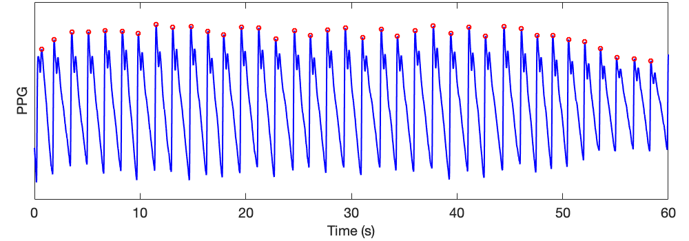

# PPG Beat Detection

This page provides a few examples of how to get started with the PPG beat detectors.

## Detecting beats in a PPG signal

This tutorial demonstrates how to detect beats in a PPG signal using algorithms in the toolbox.

- Download a minute of [PPG-Diary](https://peterhcharlton.github.io/ppg-diary/) finger PPG data  from [here](https://zenodo.org/record/5211472/files/PPGdiary1_1_min_sample.mat?download=1).
- Load this data file into Matlab. The file contains a single variable named _S_, which is a structure containing a 1-minute PPG signal (with the PPG signal given in two fields: _v_ contains the PPG samples, and _fs_ is the sampling frequency in Hz).
- Use the following Matlab commands to detect beats in the PPG (using the 'IMS' beat detector), and then plot the PPG signal and detected beats:

```matlab
beat_detector = 'IMS';     % Select Incremental-Merge Segmentation beat detector
[peaks, onsets, mid_amps] = detect_ppg_beats(S, beat_detector);     % detect beats in PPG

figure('Position', [20,20,1000,350])     % Setup figure
subplot('Position', [0.05,0.17,0.92,0.82])
t = [0:length(S.v)-1]/S.fs;             % Make time vector
plot(t, S.v, 'b'), hold on,             % Plot PPG signal
plot(t(peaks), S.v(peaks), 'or'),       % Plot detected beats
ftsize = 20;                            % Tidy up plot
set(gca, 'FontSize', ftsize, 'YTick', []);
ylabel('PPG', 'FontSize', ftsize),
xlabel('Time (s)', 'FontSize', ftsize)
```

This results in the following detected beats:
