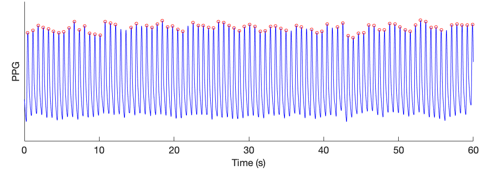
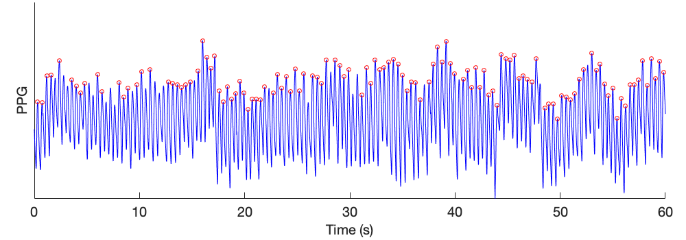
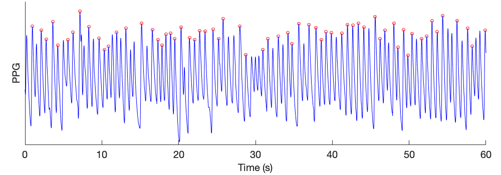
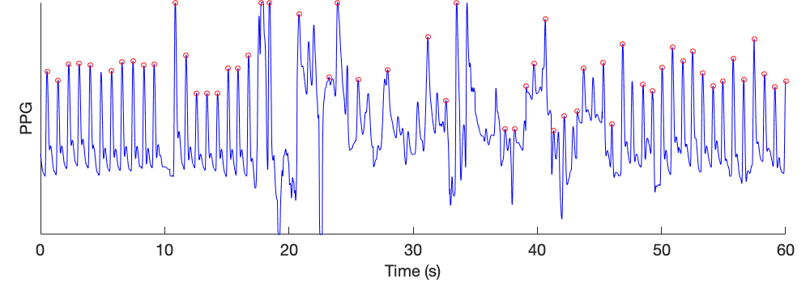

# PPG Beat Detection

Getting started with the PPG beat detectors.

---

## Detecting beats in a PPG signal

This tutorial demonstrates how to detect beats in a PPG signal using algorithms in the toolbox.

- Download a minute of [sample data](https://zenodo.org/record/6967256/files/MIMIC_PERform_1_min_normal.mat?download=1).
- Load this data file into Matlab. The data in this file is contained within a structure named _data_, which contains PPG and other signals. The PPG data can be found at _data.ppg_ (with the PPG signal given in two fields: _v_ contains the PPG samples, and _fs_ is the sampling frequency in Hz).
- Use the following Matlab commands to detect beats in the PPG (using the 'IMS' beat detector), and then plot the PPG signal and detected beats:

```matlab
S = data.ppg;   % extract PPG data
beat_detector = 'IMS';     % Select Incremental-Merge Segmentation beat detector
[peaks, onsets, mid_amps] = detect_ppg_beats(S, beat_detector);     % detect beats in PPG

figure('Position', [20,20,1000,350])     % Setup figure
subplot('Position', [0.05,0.17,0.92,0.82])
t = [0:length(S.v)-1]/S.fs;             % Make time vector
plot(t, S.v, 'b'), hold on,             % Plot PPG signal
plot(t(peaks), S.v(peaks), 'or'),       % Plot detected beats
ftsize = 20;                            % Tidy up plot
set(gca, 'FontSize', ftsize, 'YTick', [], 'Box', 'off');
ylabel('PPG', 'FontSize', ftsize),
xlabel('Time (s)', 'FontSize', ftsize)
```

This results in the following detected beats:



This tutorial is demonstrated in the following video:

<iframe width="560" height="315" src="https://www.youtube.com/embed/qYSAWzgnlhE" title="YouTube video player" frameborder="0" allow="accelerometer; autoplay; clipboard-write; encrypted-media; gyroscope; picture-in-picture" allowfullscreen></iframe>

## Detecting beats in different types of signals

- Download a minute of sample data, choosing from: [normal data](https://zenodo.org/record/6967256/files/MIMIC_PERform_1_min_normal.mat?download=1), [neonatal data](https://zenodo.org/record/6967256/files/MIMIC_PERform_1_min_neonate.mat?download=1), [atrial fibrillation data](https://zenodo.org/record/6967256/files/MIMIC_PERform_1_min_AF.mat?download=1), or [noisy data](https://zenodo.org/record/6967256/files/MIMIC_PERform_1_min_noisy.mat?download=1).
- Load this data file into Matlab. The data in this file is contained within a structure named _data_, which contains PPG and other signals. The PPG data can be found at _data.ppg_ (with the PPG signal given in two fields: _v_ contains the PPG samples, and _fs_ is the sampling frequency in Hz).
- Use the following Matlab commands to detect beats in the PPG (using the 'IMS' beat detector), and then plot the PPG signal and detected beats:

```matlab
S = data.ppg;   % extract PPG data
beat_detector = 'IMS';     % Select Incremental-Merge Segmentation beat detector
[peaks, onsets, mid_amps] = detect_ppg_beats(S, beat_detector);     % detect beats in PPG

figure('Position', [20,20,1000,350])     % Setup figure
subplot('Position', [0.05,0.17,0.92,0.82])
t = [0:length(S.v)-1]/S.fs;             % Make time vector
plot(t, S.v, 'b'), hold on,             % Plot PPG signal
plot(t(peaks), S.v(peaks), 'or'),       % Plot detected beats
ftsize = 20;                            % Tidy up plot
set(gca, 'FontSize', ftsize, 'YTick', [], 'Box', 'off');
ylabel('PPG', 'FontSize', ftsize),
xlabel('Time (s)', 'FontSize', ftsize)
```

This results in the following detected beats:

_**Neonatal data**_


_**Atrial fibrillation data**_


_**Noisy data**_


